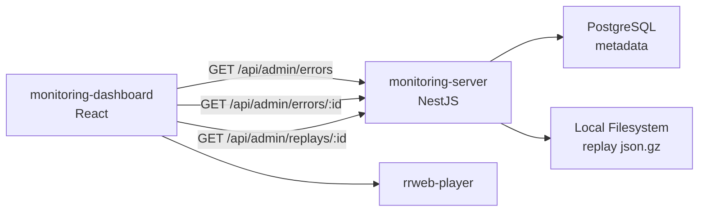

# Frontend Technical Requirements Document (TRD)

## 1. 전체 아키텍처

monitoring-dashboard는 React 기반의 관리자 대시보드이다. monitoring-server의 `/api/admin/*` 조회 API를 호출하여 에러 목록, 에러 상세, replay 재생 화면을 제공한다.

실서비스 프론트엔드에서 발생한 500 에러와 rrweb replay payload는 monitoring-server의 `POST /api/replays`로 저장된다. monitoring-dashboard는 직접 수집 기능을 수행하지 않고, 저장된 metadata와 replay payload를 조회하고 시각화하는 역할만 담당한다.



## 2. 역할과 책임

monitoring-dashboard의 책임은 다음으로 한정한다.

- 에러 목록 조회
- 에러 상세 조회
- 에러 발생 이벤트 조회
- replay payload 조회
- rrweb-player를 통한 replay 재생
- tenant, environment, release, date range 기준 필터링

monitoring-dashboard는 다음 책임을 가지지 않는다.

- 에러 수집
- replay 저장
- tenant/public_key 검증
- replay gzip 파일 직접 접근
- 서버 파일시스템 직접 접근
- 로그인/권한 처리

초기 MVP에서는 로그인 없이 구현한다. 배포 시 dashboard 접근은 IP allowlist 또는 reverse proxy 레벨에서 차단한다.

## 3. 기술 스택

- Package Manager: pnpm
- Framework: React 19
- Language: TypeScript 5
- Build: Vite
- Routing: React Router 7
- Data Fetching: TanStack Query 5 (`@tanstack/react-query@5.100.13`)
- Styling: Tailwind CSS 4
- Replay Player: rrweb-player
- Architecture: Feature-Sliced Design
- DX: ESLint 9, Prettier 3.8.1, Husky 9.1.7, lint-staged 16.4.0, Commitlint 20.5.0, Steiger

## 4. 화면 라우트

### 1. 에러 목록

```text
/dashboard/errors
```

역할:

- 에러 그룹 목록 조회
- tenant, environment, release, date range 필터 제공
- 에러 메시지, 발생 횟수, 마지막 발생 시각 표시
- 에러 상세 화면으로 이동

### 2. 에러 상세

```text
/dashboard/errors/:errorId
```

역할:

- 에러 그룹 상세 정보 조회
- message, stack, page_url, request_url, status_code 표시
- 발생 이벤트 목록 표시
- 각 이벤트의 사용자, 회사, 브라우저, OS, 디바이스 정보 표시
- 연결된 replay 화면으로 이동

### 3. Replay 재생

```text
/dashboard/replays/:replayId
```

역할:

- replay metadata 조회
- replay payload 조회
- rrweb-player로 사용자 화면 흐름 재생
- 에러 발생 시점 context 표시
- recent HTTP requests 표시

## 5. API 연동

monitoring-dashboard는 monitoring-server의 Admin API만 호출한다.

- 필수:
  - GET /api/admin/errors
  - GET /api/admin/errors/:id
  - GET /api/admin/replays/:id

- 선택:
  - GET /api/admin/replays

### 공통 응답 형식

모든 Admin API는 동일한 envelope를 반환한다. 화면 컴포넌트는 envelope를 직접 다루지 않고, dashboard API client가 `data`를 unwrap한다.

성공:

```json
{
  "success": true,
  "message": "Errors fetched",
  "data": {}
}
```

실패:

```json
{
  "success": false,
  "message": "Error not found",
  "data": null
}
```

### GET /api/admin/errors

역할:

- 에러 그룹 목록 조회

쿼리 파라미터:

```text
tenant_id
environment
release
date_from
date_to
page
page_size
```

응답 예시:

```json
{
  "success": true,
  "message": "Errors fetched",
  "data": {
    "items": [
      {
        "id": "error_abc123",
        "tenant_id": "demo",
        "message": "Request failed with status code 500",
        "page_url": "https://service.example.com/orders",
        "request_url": "/api/orders",
        "status_code": 500,
        "release": "local-dev",
        "environment": "production",
        "occurrence_count": 12,
        "first_seen_at": "2026-05-27T09:00:00.000Z",
        "last_seen_at": "2026-05-27T10:00:00.000Z"
      }
    ],
    "pagination": {
      "page": 1,
      "page_size": 20,
      "total": 1,
      "total_pages": 1
    }
  }
}
```

### GET /api/admin/errors/:id

역할:

- 특정 에러 그룹 상세 조회
- 해당 에러 그룹에 속한 error_events 목록 포함

응답 예시:

```json
{
  "success": true,
  "message": "Error fetched",
  "data": {
    "id": "error_abc123",
    "tenant_id": "demo",
    "message": "Request failed with status code 500",
    "stack": "...",
    "page_url": "https://service.example.com/orders",
    "request_url": "/api/orders",
    "status_code": 500,
    "release": "local-dev",
    "environment": "production",
    "occurrence_count": 12,
    "first_seen_at": "2026-05-27T09:00:00.000Z",
    "last_seen_at": "2026-05-27T10:00:00.000Z",
    "events": [
      {
        "id": "event_abc123",
        "session_id": "1716790000000-abc123",
        "user_id": "u_123",
        "user_name": "홍길동",
        "company_id": "c_001",
        "company_name": "고객사A",
        "browser_name": "Chrome",
        "browser_version": "125.0.0.0",
        "os_name": "macOS",
        "os_version": "14.5",
        "device_type": "Desktop",
        "occurred_at": "2026-05-27T10:00:00.000Z",
        "replay_id": "replay_abc123"
      }
    ]
  }
}
```

### GET /api/admin/replays

역할:

- replay 목록 조회
- 초기 MVP에서는 필수 화면이 아니며, 필요 시 에러 상세에서 진입한다.

쿼리 파라미터:

```text
tenant_id
error_id
date_from
date_to
page
page_size
```

### GET /api/admin/replays/:id

역할:

- 특정 replay metadata와 payload 조회
- rrweb-player에 전달할 events 반환
- `events`는 rrweb 재생을 위해 FullSnapshot 이벤트를 포함해야 한다.

응답 예시:

```json
{
  "success": true,
  "message": "Replay fetched",
  "data": {
    "id": "replay_abc123",
    "tenant_id": "demo",
    "error_event_id": "event_abc123",
    "duration_ms": 120000,
    "created_at": "2026-05-27T10:00:01.000Z",
    "error": {
      "message": "Request failed with status code 500",
      "status_code": 500,
      "request_url": "/api/orders"
    },
    "context": {
      "user": {
        "user_id": "u_123",
        "user_name": "홍길동"
      },
      "company": {
        "company_id": "c_001",
        "company_name": "고객사A"
      },
      "client": {
        "browser": {
          "name": "Chrome",
          "version": "125.0.0.0",
          "user_agent": "..."
        },
        "os": {
          "name": "macOS",
          "version": "14.5"
        },
        "device": {
          "type": "Desktop"
        }
      }
    },
    "http_requests": [],
    "events": []
  }
}
```

## 6. 폴더 구조

FSD(Feature-Sliced Design) 구조를 사용한다.

```
src/
- app/
  - providers/
  - router/
  - styles/
- pages/
  - dashboard-errors/
  - dashboard-error-detail/
  - dashboard-replay-detail/
- widgets/
  - error-list-table/
  - error-detail-panel/
  - replay-player-panel/
  - replay-context-panel/
- features/
  - filter-errors/
  - navigate-to-replay/
- entities/
  - error/
  - replay/
  - tenant/
- shared/
  - api/
  - config/
  - lib/
  - ui/
  - types/
```

### FSD import 규칙

```
app -> pages -> widgets -> features -> entities -> shared
```

하위 계층은 상위 계층을 import하지 않는다.

- 허용:
  pages -> widgets
  widgets -> features
  widgets -> entities
  features -> entities
  entities -> shared

- 금지:
  shared -> entities
  entities -> features
  features -> widgets
  widgets -> pages

## 7. 상태 관리와 데이터 패칭

초기 MVP에서는 전역 상태 관리 라이브러리를 사용하지 않는다.

```text
서버 상태:
- TanStack Query

라우트 상태:
- React Router params/search params

로컬 UI 상태:
- useState/useMemo
```

필터 상태는 URL query string에 저장한다.

예:

```text
/dashboard/errors?tenant_id=demo&environment=production&page=1
```

## 8. 화면 구성

### /dashboard/errors

필수 UI:

- 필터 영역
  - tenant
  - environment
  - release
  - date range
- 에러 목록 테이블
  - message
  - status_code
  - request_url
  - occurrence_count
  - last_seen_at
- pagination

### /dashboard/errors/:errorId

필수 UI:

- 에러 기본 정보
  - message
  - stack
  - page_url
  - request_url
  - status_code
  - release
  - environment
- 발생 이벤트 테이블
  - occurred_at
  - user_name
  - company_name
  - browser_name
  - os_name
  - device_type
  - replay link

### /dashboard/replays/:replayId

필수 UI:

- replay player
- 에러 요약
- 사용자/회사 정보
- 브라우저/OS/디바이스 정보
- recent HTTP requests 목록

## 9. 에러 처리

API 요청 실패 시 다음 UI를 제공한다.

```text
목록 조회 실패:
- 재시도 버튼
- 에러 메시지 표시

상세 조회 실패:
- 이전 화면으로 돌아가기 버튼
- 재시도 버튼

replay payload 없음:
- "Replay 데이터를 찾을 수 없습니다." 표시

replay payload 불완전:
- "Replay 데이터가 불완전합니다." 표시

rrweb-player 재생 실패:
- "Replay 재생 중 오류가 발생했습니다." 표시
```

## 10. 보안 정책

MVP 로컬 단계:

- 로그인 없음
- monitoring-server의 Admin API를 직접 호출
- API base URL은 환경변수로 관리

배포 전 필수:

- dashboard 접근은 IP allowlist 또는 reverse proxy 레벨에서 차단
- `/api/admin/*` 접근은 monitoring-server에서 IP allowlist 적용
- 민감정보는 화면에 노출하지 않거나 masking 처리
- Authorization, Cookie, token, x-api-key 등 민감 header는 표시하지 않음
- request body, response body는 MVP에서 표시하지 않음

## 11. 환경변수

```text
VITE_MONITORING_API_BASE_URL=http://localhost:4000
```

예:

```ts
const API_BASE_URL = import.meta.env.VITE_MONITORING_API_BASE_URL;
```

## 12. 구현 순서

1. Vite, React, TypeScript, TailwindCSS 프로젝트 생성
2. pnpm 설정
3. ESLint, Prettier, Husky, lint-staged, Commitlint 설정
4. Feature-Sliced Design 폴더 구조 생성
5. Steiger 설정
6. React Router 설정
7. TanStack Query 설정
8. API client 생성
9. `/dashboard/errors` route 생성
10. `GET /api/admin/errors` 연동
11. 에러 목록 테이블 구현
12. 필터 query string 연동
13. `/dashboard/errors/:errorId` route 생성
14. `GET /api/admin/errors/:id` 연동
15. 에러 상세 정보 구현
16. 발생 이벤트 목록 구현
17. `/dashboard/replays/:replayId` route 생성
18. `GET /api/admin/replays/:id` 연동
19. rrweb-player 연동
20. replay context 패널 구현
21. API 실패/빈 상태 UI 구현
22. Steiger 구조 검사 통과
23. 로컬 통합 테스트
24. 배포 환경 결정

## 13. MVP 완료 조건

- `/dashboard/errors`에서 에러 목록을 볼 수 있다.
- tenant/environment/release/date 기준 필터링이 가능하다.
- `/dashboard/errors/:errorId`에서 에러 상세와 발생 이벤트를 볼 수 있다.
- 발생 이벤트에서 replay 화면으로 이동할 수 있다.
- `/dashboard/replays/:replayId`에서 rrweb-player로 replay를 재생할 수 있다.
- API 실패, replay 없음, 빈 목록 상태를 처리한다.
